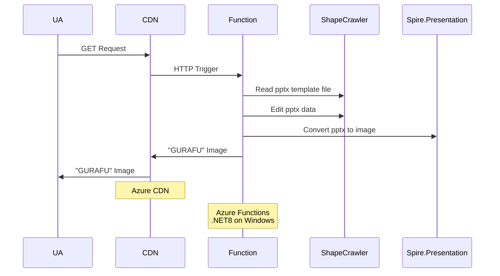

# NantoNBai

私はこのスライドに示されているグラフを愛しています。

https://speakerdeck.com/papix/hatena-engineer-seminar-number-10?slide=52

>

常々気軽にこのようなグラフを作成したいと思っていました。

思いが結実したのがこのリポジトリとAzure Functionsアプリです。

## Usage

以下のようなURLをゲットします。

`https://n-bai.koudenpa.dev/api/Generate.png?name=ポート番号&from=80&to=443`

>

再現度はあまり高くないのでもうすよし「ヨセ」たいと考えています。

以下のようなURLで共有可能です。

https://n-bai.koudenpa.dev/api/Viewer?name=ポート番号&from=80&to=443

## API Spec

https://n-bai.koudenpa.dev/api/swagger/ui

https://n-bai.koudenpa.dev/api/swagger.json

## Achitecture?

このようなグラフの良いところの一つには、オフィスソフトで「雑に」作られたグラフであるところがあります。

その魅力をスポイルしてはなりません。

そのため、グラフはPowerPoint互換で生成し、適当にWebブラウザで表示できる形式に変換しました。

FaaS...[Azure Functions](https://learn.microsoft.com/ja-jp/azure/azure-functions/functions-overview)の関数で生成、その結果を[CDN](https://learn.microsoft.com/en-us/azure/cdn/cdn-overview) ~~...[Front Door](https://learn.microsoft.com/en-us/azure/frontdoor/front-door-overview)~~ でキャッシュが素直な構成でしょう。

当初は低レイヤな OpenXML SDK を用いて生成を試みていましたが、[異様に難解](https://learn.microsoft.com/ja-jp/office/open-xml/working-with-presentations)だったので諦めました。

ありがとう [ShapeCrawler](https://github.com/ShapeCrawler/ShapeCrawler)。

OpenXML はデータフォーマットなだけで、これによってpptxファイルを生成できても、画像データにはなりません。

ありがとう [Spire.Presentation（無料版）](https://jp.e-iceblue.com/download/free-spire-presentation-for-net.html)。
