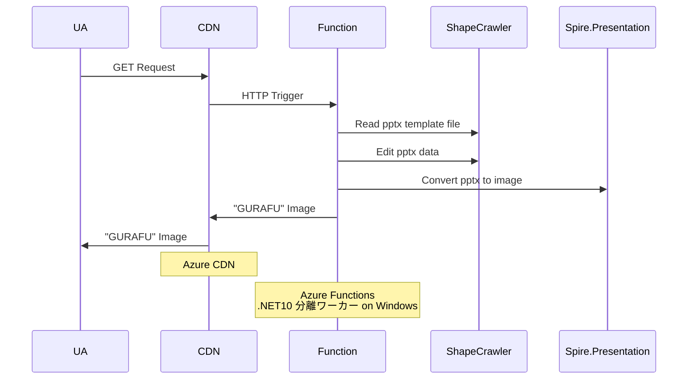

# NantoNBai
[](https://github.com/7474/NantoNBai/actions/workflows/e2e.yml)

私はこのスライドに示されているグラフを愛しています。

https://speakerdeck.com/papix/hatena-engineer-seminar-number-10?slide=52

>


常々気軽にこのようなグラフを作成したいと思っていました。

思いが結実したのがこのリポジトリとAzure Functionsアプリです。


## Usage

以下のようなURLをゲットします。

`https://n-bai.koudenpa.dev/api/Generate.png?name=ポート番号&from=80&to=443`

>

再現度はあまり高くないのでもうすよし「ヨセ」たいと考えています。

以下のようなURLで共有可能です。

https://n-bai.koudenpa.dev/api/Viewer?name=ポート番号&from=80&to=443

## API Spec

https://n-bai.koudenpa.dev/api/swagger/ui

https://n-bai.koudenpa.dev/api/swagger.json


## Achitecture?


```mermaid
sequenceDiagram
    UA->>CDN: GET Request
    CDN->>Function: HTTP Trigger
    Function->>ShapeCrawler: Read pptx template file
    Function->>ShapeCrawler: Edit pptx data
    Function->>Spire.Presentation: Convert pptx to image
    Function->>CDN: "GURAFU" Image
    CDN->>UA: "GURAFU" Image
    Note over CDN: Azure CDN
    Note over Function: Azure Functions<br/>.NET10 分離ワーカー on Windows
```

このようなグラフの良いところの一つには、オフィスソフトで「雑に」作られたグラフであるところがあります。

その魅力をスポイルしてはなりません。

そのため、グラフはPowerPoint互換で生成し、適当にWebブラウザで表示できる形式に変換しました。

FaaS...[Azure Functions](https://learn.microsoft.com/ja-jp/azure/azure-functions/functions-overview)の関数で生成、その結果を[CDN](https://learn.microsoft.com/en-us/azure/cdn/cdn-overview) ~~...[Front Door](https://learn.microsoft.com/en-us/azure/frontdoor/front-door-overview)~~ でキャッシュが素直な構成でしょう。

当初は低レイヤな OpenXML SDK を用いて生成を試みていましたが、[異様に難解](https://learn.microsoft.com/ja-jp/office/open-xml/working-with-presentations)だったので諦めました。

ありがとう [ShapeCrawler](https://github.com/ShapeCrawler/ShapeCrawler)。

OpenXML はデータフォーマットなだけで、これによってpptxファイルを生成できても、画像データにはなりません。

ありがとう [Spire.Presentation（無料版）](https://jp.e-iceblue.com/download/free-spire-presentation-for-net.html)。


## Development

Azure Functions の関数アプリは .NET 10 の**分離ワーカーモデル**で動いています。
[in-process モデルは 2026-11-10 にサポートが終了する](https://azure.github.io/jpazpaas/2024/04/01/azure-functions-inprocess-end-of-support-FVN7-7PZ.html)ためです。

オフィスドキュメントの操作と画像変換が Windows に依存しているため、
ターゲットフレームワークは `net10.0-windows`、デプロイは x64 のままです。

OpenAPI 拡張が提供する swagger エンドポイントは `HttpRequestData` ベースのままで
ASP.NET Core 統合 (`ConfigureFunctionsWebApplication`) と併用すると壊れるため、
関数は `HttpRequestData` / `HttpResponseData` で書いています。

- https://github.com/Azure/azure-functions-dotnet-worker/issues/2071
- https://github.com/Azure/azure-functions-openapi-extension/issues/617

### ローカル実行

`local.settings.json` はリポジトリに含めていないので、サンプルからコピーしてください。
`FUNCTIONS_WORKER_RUNTIME` が `dotnet-isolated` でないとホストが起動しません。

```sh
cp NantoNBaiFunction/local.settings.sample.json NantoNBaiFunction/local.settings.json
cd NantoNBaiFunction
func start
```

### 疎通確認

CI と CD が使っているものと同じスクリプトで、全エンドポイントの疎通を確認できます。

```sh
pwsh -File scripts/Invoke-SmokeTest.ps1 -BaseUrl http://localhost:7071
```

### デプロイ

master への push で [CD](.github/workflows/cd.yml) が発行とデプロイを行い、
デプロイ後に上記の疎通確認を実行します。

in-process から分離ワーカーへの切り替えのように、
ランタイム設定とペイロードを同時に入れ替える必要がある変更は、
[Migrate to isolated worker](.github/workflows/migrate-to-isolated.yml) を手動実行してください。
デプロイスロットで疎通確認してから本番とスワップするため、不整合な状態を本番に晒しません。
