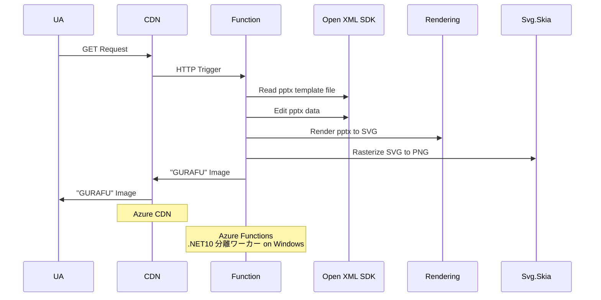

# NantoNBai
[](https://github.com/7474/NantoNBai/actions/workflows/e2e.yml)

私はこのスライドに示されているグラフを愛しています。

https://speakerdeck.com/papix/hatena-engineer-seminar-number-10?slide=52

>


常々気軽にこのようなグラフを作成したいと思っていました。

思いが結実したのがこのリポジトリとAzure Functionsアプリです。


## Usage

以下のようなURLをゲットします。

`https://n-bai.koudenpa.dev/api/Generate.png?name=ポート番号&from=80&to=443`

>

再現度はあまり高くないのでもうすよし「ヨセ」たいと考えています。

以下のようなURLで共有可能です。

https://n-bai.koudenpa.dev/api/Viewer?name=ポート番号&from=80&to=443

## API Spec

https://n-bai.koudenpa.dev/api/swagger/ui

https://n-bai.koudenpa.dev/api/swagger.json


## Achitecture?


```mermaid
sequenceDiagram
    UA->>CDN: GET Request
    CDN->>Function: HTTP Trigger
    Function->>Open XML SDK: Read pptx template file
    Function->>Open XML SDK: Edit pptx data
    Function->>Rendering: Render pptx to SVG
    Function->>Svg.Skia: Rasterize SVG to PNG
    Function->>CDN: "GURAFU" Image
    CDN->>UA: "GURAFU" Image
    Note over CDN: Azure CDN
    Note over Function: Azure Functions<br/>.NET10 分離ワーカー on Windows
```

このようなグラフの良いところの一つには、オフィスソフトで「雑に」作られたグラフであるところがあります。

その魅力をスポイルしてはなりません。

そのため、グラフはPowerPoint互換で生成し、適当にWebブラウザで表示できる形式に変換しました。

FaaS...[Azure Functions](https://learn.microsoft.com/ja-jp/azure/azure-functions/functions-overview)の関数で生成、その結果を[CDN](https://learn.microsoft.com/en-us/azure/cdn/cdn-overview) ~~...[Front Door](https://learn.microsoft.com/en-us/azure/frontdoor/front-door-overview)~~ でキャッシュが素直な構成でしょう。

当初は低レイヤな OpenXML SDK を用いて生成を試みていましたが、[異様に難解](https://learn.microsoft.com/ja-jp/office/open-xml/working-with-presentations)だったので諦め、
[ShapeCrawler](https://github.com/ShapeCrawler/ShapeCrawler) を使っていました。

今は [Open XML SDK](https://github.com/dotnet/Open-XML-SDK) で直接触っています
([NantoNBaiOpenXml](NantoNBai/NantoNBaiOpenXml.cs))。
難解さが解消したわけではなく、面倒で人間が諦めていたところを生成AIに委譲できるようになった、というのが実態です。

run をそのまま残して `a:t` の中身を入れ替えるので、テンプレートから継承した書式は壊れません。

OpenXML はデータフォーマットなだけで、これによってpptxファイルを生成できても、画像データにはなりません。

かつては Spire.Presentation（無料版）で変換していましたが、
無料版が変換した画像に評価版の透かしを入れるようになったため、自前で描くことにしました
([NantoNBai/Rendering](NantoNBai/Rendering))。

変換は **pptx → SVG → PNG** の 1 本道です。
テンプレートの図形・テキスト・グラフを読んで SVG を組み立て、
ラスタライズは [Svg.Skia](https://github.com/wieslawsoltes/Svg.Skia)（MIT）に任せています。
描画の実装が 1 つなので、SVG と PNG で見た目がずれません。

テンプレートが使っている構造 (プレースホルダーのテキスト・折線矢印・単純な縦棒グラフ) だけを扱い、
知らない構造に出会ったら例外にしています。黙って違う絵を出さないためです。

文字は同梱した [BIZ UDPGothic](https://github.com/googlefonts/morisawa-biz-ud-gothic)（OFL 1.1、
[fonts/OFL.txt](NantoNBai/fonts/OFL.txt)）で描き、グリフはアウトラインにして SVG に埋めています。
実行環境やブラウザのフォントに依存しないので、CI・本番・手元で同じ絵になります。

ありがとう [SkiaSharp](https://github.com/mono/SkiaSharp) と [Svg.Skia](https://github.com/wieslawsoltes/Svg.Skia)。


## Development

### ローカル実行

`local.settings.json` はリポジトリに含めていないので、サンプルからコピーしてください。
`FUNCTIONS_WORKER_RUNTIME` が `dotnet-isolated` でないとホストが起動しません。

```sh
cp NantoNBaiFunction/local.settings.sample.json NantoNBaiFunction/local.settings.json
cd NantoNBaiFunction
func start
```

### 疎通確認

CI と CD が使っているものと同じスクリプトで、全エンドポイントの疎通を確認できます。

```sh
pwsh -File scripts/Invoke-SmokeTest.ps1 -BaseUrl http://localhost:7071
```

### デプロイ

master への push で [CD](.github/workflows/cd.yml) が発行とデプロイを行い、
デプロイ後に上記の疎通確認を実行します。
